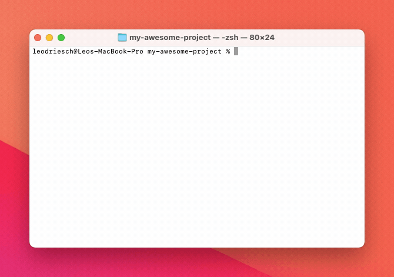

<h1 align="center">fill-packagejson</h1>

    <strong>A CLI tool to fill in missing fields in package.json files. Drop-in replacement for `npm init -y`.</strong>

    
    
    

    <a href="#-usage"><b>Usage</b></a>
      •  
    <a href="#-development"><b>Development</b></a>
      •  
    <a href="#-contribute"><b>Contribute</b></a>

---

`fill-packagejson` helps you to complete the information in your `package.json`
files for optimal display on NPM. Also generates a license file if you got none.

It can also create a `package.json` file for a new project as a drop-in
replacement for `npm init -y`.

 

    

 

## ❯ Usage

Run `npx fill-packagejson` in your project directory.

If you already have a `package.json` file the CLI will pick it up and ask you to
fill in the missing fields.

If you do not already a `package.json` file, the CLI will ask you all the
questions and create one.

### What fields will be filled in?

Most of the fields that NPM uses to display your package will be filled in:

- `name`
- `version`
- `description`
- `keywords`
- `homepage`
- `bugs` (if you have a GitHub repository)
- `license`
- `author`
- `repository`

You should fill in a `main` or `bin` field yourself.

The `contributors` field is not automatically filled in, you may want to do that
yourself though.

 

## ❯ Development

First install the dependencies with `npm install`. Then you can run
`npm run dev` to compile the files and run the CLI locally.

To publish a new version increase the version number with
`npm version <major|minor|patch>` and publish with `npm publish`. The files will
be automatically compiled before publishing.

 

## ❯ Contribute

If you think you have any ideas that could benefit the project, feel free to
create an issue or pull request!

 

---

    
        Project by Leo Driesch, released under <a href="https://github.com/leodr/fill-packagejson/blob/main/LICENSE">MIT license</a>.
    

    
    &nbsp;&nbsp;
    

